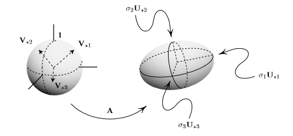

---
output:
  pdf_document:
    includes:
      before_body: beforebody.tex
      in_header: header.tex
---


```{r setup, include=FALSE}
knitr::opts_chunk$set(echo = TRUE, fig.align = "center", 
                      fig.width = 4, fig.height = 3.5)
library(tidyverse)
library(lubridate)
library(MVA)
library(stringr)
theme_set(theme_bw())
```


#### 1. Este ejercicio es para que refresquen su álgebra lineal.


**1a.** Escribe un pequeño ensayo de uno a tres párrafos e ilustra gráficamente para un caso bidimensional la conexión que hay entre la matriz de covarianzas de una nube de datos $\Sigma = \Sigma (X)$, su descomposición espectral $\Sigma = P\Lambda P^T$, y la curva de nivel uno de su forma cuadrática,i.e., ${x:x^T \Sigma x = 1}$.

```{r warning=FALSE, echo=FALSE}
library(dplyr)
library(tidyr)
library(magrittr)
library(ggplot2)
```

Para esta pregunta usamos una base de datos con dos variables y las normalizamos.

```{r}
dat_ej1a <- read.table("usoEnergia.dat", header = TRUE)
dat <- dat_ej1a %>% select(x,y)
#normailizamos
norm.dat <- scale(dat)
```

La matriz de covarianzas es simétrica defina positiva. Esta matriz define la forma de los datos, la covarianza captura la orientación, mientras que la extención a lo largo del eje es capturada por la varianza. 

```{r}
mat_cov <- cov(norm.dat)
print(mat_cov)
ggplot(data.frame(norm.dat), aes(x=x, y=y))+
  geom_point(size = 2, shape = 1)+
  theme_bw() +
  coord_fixed(1)
```


Al querer representar la matriz de covarianzas con vectores y sus magnitudes, se busca un vector $v$ que apunte a la dirección donde los datos tienen mayor extensión y cuya magnitud sea igual a la varianza. 

La varianza de los datos proyectados es $v^T\Sigma v$, como se está buscando el vector $v$ que apunte en la dirección con mayor varianza, sus componentes deben maximizar la matriz de covarianzas $v^T\Sigma v$ de los datos proyectados. 

El eigenvector de la matriz de covarianzas siempre apunta en la dirección donde la varianza es mayor, y la magnitud es igual a su eigenvalor correspondiente. 

```{r}
des_es <- eigen(mat_cov)
print(des_es)
ggplot(data.frame(norm.dat), aes(x=x, y=y)) +
  geom_point(size = 2, shape = 1)+theme_bw() + 
  geom_segment(aes(x = 0, y = 0, xend = 0.7, yend = 0.7), color = "blue", arrow = arrow())+
  geom_segment(aes(x = 0, y = 0, xend = -0.7, yend = 0.7), color = "green",arrow = arrow()) +
  coord_fixed(1)
```


Toda matriz simétrica es diagonalizable y los eigenvectores son ortogonales por lo tanto por lo tanto la matriz de covarianzas $\Sigma$ tiene descomposición espectral.

$\Sigma = P\Lambda P^T$ 

Donde $\Lambda$ es una matriz diagonal formada por los eigenvalores de $\Sigma$ y los vectores columna de $P$ son los eigenvectores de $\Sigma$. 

Las curvas de nivel nos dan elipses cuando son cuadráticas. Tiene que ver que los ejes de las elipses son eigenvectores, cuyas longitudes son eigenvalores. 

```{r}
des_es <- eigen(mat_cov)
print(des_es)
ggplot(data.frame(norm.dat), aes(x=x, y=y)) +
  geom_point(size = 2, shape = 1)+theme_bw() + 
  geom_segment(aes(x = 0, y = 0, xend = 0.7, yend = 0.7), color = "red", arrow = arrow())+
  geom_segment(aes(x = 0, y = 0, xend = -0.7, yend = 0.7), color = "green",arrow = arrow()) +
   stat_ellipse(color = "blue") +
  coord_fixed(1)
```

**1b.** Describe la interpretación geométrica de la descomposición SVD y diagonalización como producto de transformaciones por matrices ortogonales y diagonales.

La interpretación geométrica de la descomposición SVD se puede visualizar como una rotación, reflexión y escalamiento.

$A = USV^T$

Al multiplicar por $V^T$ rota y refleja la matriz $X$. Como $S$ sólo tiene valores en la diagonal ordenados $s_1 > s_2 > ... > s_n$ hace un escalamiento en la matriz $X$. $V$ rota la matriz $X$ en una posición donde los eigenvalores ahora representan un factor de escala a lo largo del eje $x$ y $y$. Finalmente $U$ rota y refleja la matriz $X$ de vuelta a la base estándar. Que sería exactamente lo mismo que $Ax$. 

$U$, $V$ son matrices ortogonales y $S$ es una matriz diagonal, por lo tanto la diagonalización que como producto de transformaciones por matrices ortogonales y diagonales es la misma interpretación geométrica que la de SVD. 

**1c.** ¿Qué relación hay entre la descomposición SVD de una matriz $A$ y la diagonalización de su matriz de covarianzas (suponiendo que $A$ es centrada) (Hint: $\Sigma (A) = \frac{1}{n} A^TA$)?

La nube de datos se puede descomponer en valores singulares que son los eigenvalores de la matriz de covarianzas. 


---


#### 2. Este ejercicio es para que usen su álgebra lineal en PCA.


**2a.** Explica la técnica de PCA desde el punto de vista desarrollado en los incisos anterior.

Partiendo de la pregunta anterior el objetivo de PCA es hacer una transformación lineal usando la descomposición espectral o SVD de la matriz de covarianzas $\Sigma$ de tal forma que se obtengan componentes que resuman la mayor cantidad de variación de la nube de datos por medio de una combinación lineal de las variables. 

**2b.** ¿Cuál es la relación entre la matriz de loadings en PCA y las correlaciones entre las variables originales y las componentes principales?

Los loadings son dicen cuánto contribuye cada variable original a los componentes principales. 

**2c.** En PCA, ¿cómo interpretan el significado de las componentes principales? ¿Qué es la rotación varimax?

La componente principal se interpreta en función de las variables más correlacionadas con la misma. 

La rotación varimax efectúa una rotación ortogonal de los ejes factoriales. El objetivo de la rotación es conseguir que la correlación de cada una de las variables sea lo más próxima a 1 con solo una de las componentes y próxima a cero con todos los demás, i.e. castiga a las variables no apegadas a una componente.


---

#### 3. Este ejercicio es para que piensen en la geometría subyacente de algunos métodos como análisis de correspondencias

**3a.** Describe los tipos de datos estadísticos y algunas formas usuales de medir distancias entre ellos. 

Los principales tipos de datos son binarios o booleanos, representan una cualidad y solo tienen dos categorías, por ejemplo verdadero o falso. Datos categóricos o nominales también describen  una cualidad del individuo pero poseen más de dos posibles categorías, por ejemplo nacionalidad. Datos ordinales, son un tipo de datos categóricos que poseen un orden interno por ejemplo si las categorías son malo, regular y bueno se trata de datos ordinales. Por otro lado tenemos otro tipo de datos que son los numéricos y estos pueden ser con escala de razón o de intervalo. En el caso de escala de razón los valores numéricos tienen un valor absoluto, en los de intervalo los valores numéricos representan un valor relativo, por ejemplo al medir latitud y longitud o temperatura. 
Hay diferentes formas de medir la distancia estadística dependiendo del tipo de datos que se estén usando. Para datos de tipo booleano se puede usar la medida de concordancia simple o el coeficiente de Jaccard. Para datos de escala de razón hay muchas formas algunos ejemplos son la distancia de Minkowski o la euclideana. Para datos de intervalo se puede usar la distancia de Canberra o la de  Pearson que tienen la característica de ser invariantes frente a cambios de escala. Para datos categóricos se puede usar la medida de distancia que en genética se conoce como distancia de Cavalli-Sforza. En el caso de datos mixtos se puede usar la medida de distancia de Gower. 


**3b.**  ¿De qué manera medimos distancias entre perfiles fila y columna cuando usamos la técnica de Análisis de Correspondencias?

Medimos las distancias con la frecuencia relativa independiente 
vs la observada en el universo en el que viven los individuos
con la distancia $\chi^2$.


**3c.** Si se decide medir distancias 
usando una matriz diagonal con entradas positivas *W*, ¿cómo cambiarían su medida de media,
varianza y covarianza empírica, ¿cómo cambia la geometría subyacente)

Partimos de usar la siguiente medida de distancias: $$ dist^2(x,y) = (x-y)^T W (x-y) $$ Con: $W$ positiva definida.

¿como cambiarían su medida de media, varianza y covarianza empírica, ¿como cambia la geometría subyacente) ?

Caso 1. Supongamos a $W$ como la matriz identidad, es decir: $$W = I_n $$ Dado que $W$ es la matriz identidad, usando la propiedad que para toda matriz $A$ el producto por la matriz identidad es igual a si misma: $$A * I_n = A$$ Podemos afirmar que $dist^2(x,y) = (x-y)^T W (x-y) = (x-y)^T(x-y)$ , sin perdida de generalidad para todo vector $x$ y $y$. El cual es simplemente la norma euclidiana.

Caso 2. Ahora supongamos a que $W$ esta compuesta por la matriz identidad multiplicada por un vector de entradas mayores a cero. $$ W°= I_n*a\quad con \quad a=[a_1 a_2 \dots a_n] \quad a_i>0 \quad \forall i=1, \dots,n $$ Lo que da como resultado que tengamos una matriz identidad reescalada en magnitud. Es decir, en la diagonal de nuestra matriz $W°$, encontramos unos o valores distintos que 1. Supongamos el individuo $i-esimo$. Supongamos que la matriz $W°$ es igual a la matriz identidad salvo constante $c$ mayor a cero en la entrada $i-esima$ de la diagonal. La distancia tomando del individuo $i-esimo$ con todos los demás sufrirá de un escalamiento dependiendo si $c<1$ o $c>1$; es decir se sobre estimara o subestimará la distancia euclidiana, según el valor de $c$. Lo que podemos concluir de este caso, es que el alterar la matriz identidad $I_n$ mediante la multiplicación de un vector con entradas mayor a cero, es que estamos alterando la distancia y esto supondría que tenemos un conocimiento previo sobre los individuos, es decir, le estamos aplicando un peso a la distancia basado en un conocimiento a priori.

**3d. ** ¿Por qué es razonable la distancia $\chi^2$ entre frecuencias de datos categóricos? Busca un ejemplo para mostrar que es más natural.

La medicion de la similitud o distancias entre dos puntos es un proceso que sirve como base para la implementacion de tecnicas de metodos multivariados. Partiendo del caso continuo, es decir, cuando nuestra matriz de individuos $X$ presenta en sus entradas datos continuos podemos pensar en aplicar metodos como el SVM, al medir las distancias entre puntos y poder general el hiperplano separador. Las tecnicas comunes para medir la distancia entre datos continuos son la distancia Euclidiana y la distancia Minkowski. Sin embargo, la medición de similitud en datos categoricos no es trivial como en los datos continuos. El problema central de los datos categoricos es que no tienen una naturaleza ordinal inherente, por lo que comparar datos categoricos directamente no es posible. La forma mas usual en encontrar similitudes entre atributos categoricos es mediante la asignación de $1$ unos en el caso de coincidencia y $0$ en el caso de no-coincidencia. La similitud entre los atributos está ligada directamente al universo de atributos en el que vive. Es apropiado pensar que el uso de la distancia $\chi ^2$ para datos categoricos tiene sentido. Recordar que: $$\tilde{\chi}^2=\frac{1}{d}\sum_{k=1}^{n} \frac{(O_k - E_k)^2}{E_k}$$ Notamos que el numerador denotado por la diferencia al cuadrado denota una comparación relativa. Podemos pensar al numerador como una diferencia entre individuos (numerador) evaluados respecto al universo en el que viven (denominador).

Ejemplos de el uso de esta distancia para datos categoricos:

$\bullet$ Ejemplo en clase, de color de ojos y pelo. En este ejemplo evaluamos que tan comun o poco comun eran las combinaciones color de ojos y color de pelo.

$\bullet$ En el trabajo de campo de la ecologia y la biologia se evaluan las las similitudes o disimilitudes entre especies. Es evidente que el estudio de estas disciplinas tiene base en muestras, ya que el analizar el universo entero de ciertas especies resultaria imposible.


---

#### 4. En este ejercicio harán un repaso de la idea y técnica del escalamiento multidimensional


**4a.** En un parrafo describe el objetivo (no el procedimiento) del Classical Multidimensional Scaling:

El objetivo del Multidimensional Scaling es reconstruir datos $X$ y mapear estos datos. La motivacion de este metodo se debe a que en muchas ocasiones, dado nuestro experimiento o investigacion, en vez de poder observar distancias euclidianas y medir la separacion entre los individuos de la matriz $X$, solo tenemos Similitudes o disimilitudes>. Es por eso que el proposito del metodo sera producir estas coordenadas, es decir, el MDS nos da la posibilidad de tener una representacion cartografica de algo que en si, no forma parte del plano $\Re^2$. 


**4b.** Demuestra:

Por demostrar:
Si $X$ es una matriz de datos centrada con $n$ individuos y $D^2$ es la matriz de distancias euclidianas entre $n$ individuos entonces:
$XX^T=\frac{1}{2}knD^2kn$

Sea $kn=In-\frac{1}{n}\mathbb{1}n\mathbb{1}n$

\[
In=
  \begin{pmatrix}
    1 & \cdots&  0 \\
   \cdots& 1 &\cdots  \\
    0 & \cdots & 1 \\
  \end{pmatrix}_{nxn}
\]

\[
\mathbb{1}n=
    \begin{pmatrix} 
         1\\
         1\\
         1\\
         1\\
    \end{pmatrix}_{nx1}
 \]
\[
{\mathbb{1}n}^T=
    \begin{pmatrix} 
         1
         1
         1
         1
    \end{pmatrix}_{1xn}
 \]


\[
\mathbb{1}n{\mathbb{1}n}^T=
    \begin{pmatrix} 
         1 & \cdots& 1\\
         \vdots &\ddots& \vdots\\
        1 & \cdots& 1\\
    \end{pmatrix}_{nxn}
 \]


Demostración:

$D(x_i, x_j)^2=\|x_i x_j \|^2=(x_i-x_j)^T(x_i-x_j)=x_i^Tx_i-x_i^Tx_j-x_j^Tx_i+x_j^Tx_j$

$\|x_i\|^2-2x_i^Tx_j+\|x_j\|^2$ ... (1)

Sea $W=w{\mathbb{1}n}^t$   \[w=\begin{pmatrix}\|x_1\|^2\\ \|x_2\|^2  \\\vdots\\ \|x_n\|^2 \end{pmatrix}\]

Entonces \[W=\begin{bmatrix}  \|x_1\|^2 & \|x_1\|^2 & \cdots & \|x_1\|^2 \\\|x_2\|^2 & \|x_2\|^2 & \cdots & \|x_2\|^2 \\\vdots&\vdots&\ddots&\vdots\\\ \|x_n\|^2 & \|x_n\|^2 & ... & \|x_n\|^2\end{bmatrix} \] y  \[W^T=\begin{bmatrix}  \|x_1\|^2 & \|x_2\|^2 & \cdots & \|x_n\|^2 \\\|x_1\|^2 & \|x_2\|^2 & \cdots & \|x_n\|^2 \\\vdots&\vdots&\ddots&\vdots\\\ \|x_1\|^2 & \|x_2\|^2 & ... & \|x_n\|^2\end{bmatrix} \]

Dada $W$, $D^2$ puede ser escrita como:

$D^2=W-2X^TX+W^T$...(2)

Centrando la matriz de distancias:

$knD^2kn=(knW-2knX^TX+knW^T)kn$

$=knWkn-2knX^TXkn+knW^Tkn$

$knD^2kn=-2knX^TXkn$

Notar:

$Xkn$ es la matrix $X$ centrada en columnas. 

$Xkn=\hat{X}$

$C=knD^2kn=-2\hat{X}^T\hat{X}$

$\hat{X}^T\hat{X}=-\frac{1}{2}knD^2kn$ 


**4c.** Usen el dataset eurodist en la librería datasets de R para reconstruir un mapa de las ciudades usando Classical MDS (pueden usar funciones o paqueterías ya hechas en R, e.g. cmdscale)Interpreta el mapa. ¿Por qué aparece rotado? Matemáticamente, ¿cuál es la causa? (Hint: invarianza bajo multiplicación por matrices ortogonales).

###Cálculo de las distancias usando la función cmdscale###
```{r}
euromat <-  as.matrix(eurodist)
euromat[1:5,1:5]

fit <- cmdscale(euromat, eig = TRUE, k = 2)
x <- fit$points[, 1]
y <- fit$points[, 2]
```

```{r}
plot(x, y, pch = 19, xlim = range(x) + c(0, 600))
text(x, y, pos = 4, labels = labels(eurodist))

```
###Usando el mismo dataset ahora calculamos las distancias ejecutando cada paso del MDS#
```{r}
dim(euromat)
d <- euromat
n <- nrow(d)
kn <- diag(1, n) - (1/n)*rep(1, n)*rep(1, n)

dim(d)
dim(kn)
b <- (-1/2) *((kn %*% d^2) %*% kn)

eigenval <- eigen(b)
c <-  diag(eigenval$values)
p <-  eigenval$vectors
fit$eig
eigenval$values

aprox <- p %*% sqrt( abs(c) ) %>% 
  as_tibble()

ggplot(aprox, aes(x = V1, y = -1*V2)) + 
  geom_point() + 
  geom_text(label = rownames(d))
```

El metodo de Multidimensional scaling usa el metodo SVD.

Sea una matriz $A$ que queremos descomponer mediante el metodo SVD. Recordemos que el metodo SVD se trata de aplicar una factorización $QR$ a la matriz $A^TA$ sin nunca escribir explicitamente $A^TA$.

En una descomposición SVD, pasamos de un espacio vectorial sea $\Re^{mxn}$ mediante el producto de dos matrices ortogonales y una matriz diagonal, es decir:
$$A=U_{mxm}D_{rxr}{v_{nxn}}^T\quad$$
$D$= matriz diagonal de eigenvalores.

Pensemos en un espacio vectorial esferico, si A no es ortogonal, entonces la transformacion SVD se ve como una elipse





SVD revelan la geometria del espacio vectorial en el que vive la matriz a transformar.
Los valores singulares $\sigma_1>, \sigma_2 \dots ,>\sigma_n$ nos dan idea de la distorsión que sufre A en la transformacion. Es importante decir que aunque los valores singulares son unicos para el espacio vectorial los vectores singulares, no lo son.


En la imagen podemos notar como la magnitud y la disparidad de magnitudes entre los valores singulares $\sigma_i$, es lo que hace que se transforme nuestro espacio vectorial.

Es por eso que solo podriamos evitar la rotacion si la matriz $A$ es ortogonal, en tal caso el valor singular $\sigma_1 = \sigma_n$

---

#### 5. Este ejercicio pretende que hagan un repaso de la idea de los métodos que expusieron sus compañeros en el curso u otros temas adicionales. Describe en una oración el objetivo de las siguientes técnicas: 

1. Correlaciones policóricas y poliseriales :
Las correlaciones policóricas y poliseriales sirven para estimar correlaciones en los casos en los que tratemos con variables ordinales, las correlaciones policóricas estiman la correlación entre variables ordinales y las poliseriales entre una variable ordinal y una variable continua. 

2. Análisis Factorial (no PCA) y Structural Equation Modeling

El análisis factorial se usa para determinar las variables que están más relacionadas con los factores más comunes y para determinar los factores necesarios para explicar los datos observados, este análisis pertenece a un marco teórico más general conocido como modelos de ecuaciones estructurales, en los cuales se busca explicar las correlaciones o covarianzas de variables observadas en función de su relación con variables latentes subyacentes. 

3. PCA dentro de una regresión lineal e interpretación de los coeficientes de regresión con diagonalización.

$\hat\beta$ es un coeficiente de regresión lineal también tenemos que  $\hat\beta = (X^TX)^{-1}X^TY$ y $\hat\Sigma$ es la matriz empírica de covarianzas.  Cada $\hat\beta_i$ es una combinación lineal de las covarianzas empíricas entre las $X_i$'s y $Y$,  ponderadas con  los elementos de $\hat\Sigma^{-1}$. Los elementos en la diagonal de la matriz de covarianzas $\hat\Sigma$ dan una medida de qué tanto se dispersan las $X_i$'s  alrededor de la media. En el caso de que no haya una correlación entre las  $X_i$'s, cada $\hat\beta_i$ representa la covarianza entre $X_i$ y $Y$ ponderada con la precisión de $X_i$. 
 También, si tenemos $PDP^T$, la eigendescomposición de $\hat\Sigma$ las columnas de $P$ son los eigenvectores de $\hat\Sigma$ y la diagonal de $D$ contiene sus eigenvalores, y las columnas de $XP$  son las observaciones observadas conocidas como componentes principales. Si transformamos $\hat\beta$ usando $P^T$ cada $\hat\beta_i$ dada por $P^T_i\hat\beta_i$ es la covarianza de la $iésima$ componente principal y $Y$  ponderada con la precisión de la $iésima$ componente  principal.

4. Item Response Theory 

Es un paradigma psicométrico utilizado en el diseño de evaluaciones, su objetivo principal es describir la probabilidad de obtener cierta respuesta en una evaluación en función de algún rasgo latente que dicha evaluación busca medir, ejemplos de estos rasgos latentes son  habilidad cognitiva, conocimiento, o alguna actitud. 

5. Multiple correspondence analysis
Es una extensión del análisis de correspondencias simples, que se aplica en el caso de tener un conjunto grande de variables categóricas. Recordemos que el análisis de correspondencias simple es una técnica conceptualmente similar al PCA pero aplicada a datos categóricos en la cual el conjunto de parámetros de chi cuadrada asociados a tablas de contingencia se descomponen en factores ortogonales.

6. Canonical correlation analysis 
Esta técnica se ocupa cuando en lugar de analizar las relaciones entre variables individuales lo que se busca es analizar la relación entre conjuntos de variables, por ejemplo en el caso de no tener una sola variable de respuesta sino un conjunto de las mismas y queremos escoger cuáles incluir en nuestro modelo.  

7.Mixed factor analysis
Es un método para tratar con datos que tengan individuos con características tanto cuantitativas como cualitativas, por lo general se aplica un análisis de PCA para las variables cuantitativas y un análisis de correspondencias múltiple (MCA) para las variables cualitativas. 

8. Canonical correlations (ver Canonical correlation analysis)


---

### 6. Planear un problema una investigación de análisis multivariado con las técnicas que hemos visto en clase. 


A raíz de los conflictos sociales al rededor del mundo se ha observado un 
incremento en la violencia observada en los últimos años. 
En particular, enfocaremos el análisis en la amenaza de libertad de 
expresión y libertad de prensa estudiando un conjunto de datos
presentado por el Comité para la Protección de Periodistas 
([*Committee to Protect Journalist CPJ*](https://cpj.org/) ). 


El conjunto de datos antes mencionado 
es una recolección de asesinatos de periodistas desde 
1992 hasta marzo de 2017 en aproximadamente 105 países. 
Cada evento o asesinato tiene información 
sobre el trabajo del periodista y 
sobre el asesinato. 


Es importante mencionar que CPJ incluye en su definición de 
periodistas al staff, freelancers o independientes, bloggers, stringers y 
ciudadanos periodistas que reportan noticias de dominio público
sin importar el medio ya sea impreso, fotográfico, de radio, televisión 
o electrónico. 


A continuación se presenta la lista de 
variables incluidas en los datos y una 
breve descripción:

  - **Motive:** variable categórica sobre el
  motivo del asesinato. Tiene tres niveles: 
  *motive confirmed, motive unconfirmed, media workers*. 
  La variable *media workers* registra el asesinato de gente
  de apoyo clave en el desarrollo de la investigación. 
  
  - **Date:** variable numérica de fecha del asesinato. Incluye mes, año y en 
  algunos casos día. Se decide únicamente considerar mes y año. 
  
  - **Name:** variable categórica única por periodista excepto cuando 
  no se conoce la identidad de la persona. 
  
  - **Sex:** variable binaria del sexo del periodista. Tiene dos
  niveles: *female, male*.
  
  - **Country Killed:** variable categórica del país donde ocurrió el 
  asesinato. La variable tiene 105 niveles. Los 30 con mayor número de asesinatos
  en orden decreciente son: *Iraq, Philippines, Syria, Mexico, Pakistan, Colombia, Russia, India, Somalia, Algeria, Brazil, Afghanistan, Bangladesh, Tajikistan, Turkey, Bosnia, Sri Lanka, Honduras, Guatemala, Rwanda, Israel, Yemen, Nigeria, Ukraine, Nepal, Sierra Leone, Peru, Thailand, Democratic Republic Of The Congo, Egypt*
  
  - **Organization:** variable categórica. Organización 
  para la que el periodista laboraba. La variable tiene 1234 niveles. 
  
  - **Nationality:** variable categórica. Nacionalidad de la persona. 
  Se tienen 170 niveles. Los treinta niveles con mayor frecuencia en orden
  descendente son: *Iraq, Syrian, Philippine, Pakistan, Mexican, Algeria, Russia, Colombia, Iraqi, Brazil, India, Somalia, Turkey, Bangladesh, France, Sri Lanka, United States, Honduras, Rwanda, Tajikistan, Nigeria, Afghanistan, United Kingdom, Sierra Leone, Germany, Italy, Peru, Yemen, Egypt, Nepal*. Esta variable requiere mayor limpieza, por lo que los niveles pueden 
  disminuir y el ordenamiento cambiar. 
  
  - **Medium:** variable categórica. Medios para los que trabajaba la persona. 
  La variable tiene 15 niveles que son las combinaciones de los 
  medios: *radio, television, print, internet*.
  
  - **Job:** variable categórica. Combinación de empleos que desempeñaba de 
  las diez posibilidades siguientes: *internet reporter, print reporter, broadcast, camera operator, editor, photographer, producer, publisher, technician, columnist*.
  
  - **Coverage:** variable categórica. Combinación de coberturas de noticias del
  periodista de los siguientes temas: *crime, politics, war, corruption, culture, human rights, business, sports*.
  
  - **Freelance:** variable binaria. El periodista laboraba para prensa independiente.
  Dos niveles: *yes, no*.
  
  - **Local/Foreign:** variable binaria. Se refiere a la procedencia del periodista.
  Dos niveles: *local, foreign*.
  
  - **Source of Fire:** variable categórica. Personas o entidades probablemente responsables
  del asesinato. Es una combinación de las siguientes opciones: *criminal group, government officials, local residents, military officials, mob violence, paramilitary group, political group, unknown fire*
  
  - **Type of Death:** variable categórica. Clasificación de asesinato de CPJ
  únicamente para los casos en los que el motivo esté confirmado.
  Las opciones son *crossfire/combat-related, dangerous assignment, murder, unknown*
  
  - **Impunity (for Murder):** variable categórica. Monitoreo realizado por 
  CPJ sobre el cumplimiento de la ley y el proceso legal para 
  los casos de asesinato confirmado. Tiene tres niveles: *yes, no, partial*. 
  El nivel *partial* se refiere a cuando algunos responsables 
  son condenados pero no la totalidad.
  
  - **Taken Captive:** variable binaria. Se refiere al secuestro del 
  periodista en un periodo inmediato previo a la muerte. 
  Dos niveles: *yes, no*.
  
  - **Threatened:** variable binaria. Se refiere a cualquier amenaza
  dirigida al periodista cualquier momento antes de ser asesinado. 
  Dos niveles: *yes, no*.
  
  - **Tortured:** variable binaria. Esto significa que el periodista 
  fue demostrablemente físicamente torturado antes de ser asesinado.
  Dos niveles: *yes, no*.


El reto del análisis multivariado para este conjunto de datos es 
el gran número de variables categóricas y 
valores faltantes de las variables. Para 
disminuir el problema de valores faltantes
se decide condicionar el análisis a los asesinatos 
con motivo confirmado (*motive confirmed*). 
Finalmente, el conjunto de datos considerando el filtro antes 
mencionado se compone de un total de 1235 
asesinatos al rededor del mundo. 

Respecto a líneas de investigación, proponemos las siguientes
hipótesis:


\bigskip


**a.** México ha sido comparado frecuentemente con Siria y otros 
países en relación a la amenaza contra la 
libertad de prensa. ¿Es esto real? 
¿En qué temas es esto cierto? Existen otros países con 
los que México se puede relacionar bajo características y 
tópicos específicos, por ejemplo impunidad o violencia. 

Técnicas posibles:
  
*Multiple Correspondence Analysis*: esta técnica es apropiada
para variables categóricas, que se tienen en el conjunto de datos. 
Además, estudia las asociaciones entre variables. Ésto nos ayuda 
a observar la asociación entre países dependiendo 
de otras variables. 

*Multidimensional Scaling*: esta técnica ayuda a visualizar la 
similitud entre individuos considerando distancias. Para 
encontrar la similitud entre los países nos ayuda si 
recodificamos algunas variables por valores numéricos. En 
el caso de variables binarias convertir a 0 y 1. O bien, darles 
un valor numérico a los diferentes niveles asignando un jerarquía
específica. Por ejemplo, en el caso de impunidad, se considera 
de mayor gravedad la impunidad total (*yes*), seguido por 
impunidad parcial (*partial*) y por último (*no*).


Una vez implementadas las técnicas esperamos obtener gráficamente
asociaciones de los países respecto a las variables restantes. 
Esperamos obtener países con comportamientos similares que 
permitan aproximarnos a perfiles generales de países. 


\bigskip

**b.** Uno de los principales intereses de CPJ es la creación de un índice
de impunidad. Este índice es importante para presionar a los
países a perseguir a los responsables en su totalidad, sobre todo 
en países que se consideran en pro de la democracia. 
Sin embargo, creemos que adicional a impunidad existen otros temas que caracterizan 
a los países respecto a la amenaza a la libertad de prensa y 
se deben de crear otros índices.
Por ejemplo, relacionado al nivel de violencia, o amenaza a prensa independiente y 
cobertura con mayor riesgo, etc. 


Técnicas posibles:


*Canonical Correlation Analysis:* ésta técnica analiza la relación de 
un conjunto de variables. Esto nos ayuda a encontrar
la relación de los conjuntos de variables por los diferentes temas 
antes mencionados con los que se puede construir uno o varios índices.

*Tetrachoric Correlation y Polychoric Correlation:* ésta técnica permite 
estimar las correlaciones entre variables binarias en el caso (*tetrachoric*)
y ordinales (*polychoric*). Esta última, puede implementarse 
asignando un valor numérico a diferentes niveles asignando un jerarquía
específica, como se mencionó antes. De esta forma, aplicar factor análisis 
para resumir la información.

*Factor Analysis y Mixed Factor Analysis*: 
estas técnica determina variables que 
representan a los datos pero con menor número de variables. 
Esto se implementa en la construcción de índices. En particular 
si se incluyen únicamente las variables del tema de 
impunidad (*Impunity*, *Threatened*, *Source of Fire*, etc.) 
podremos resumir la estructura de estas variables en una dimensión. 
Mixed Factor Analysis permite realizar lo siguiente pero 
incluyendo variables categóricas.
 


Una vez implementadas las técnicas, esperamos obtener 
índices de variables asociadas por temas generales. Por 
ejemplo, el índice de impunidad se 
conforma de las variables (*Impunity*, *Threatened*, *Source of Fire*)
que resultaron estar altamente asociadas. De esta forma, existe un nivel de 
impunidad grave en el caso de existencia de amenazas previas 
a los periodistas en general, impunidad de los responsables, los 
cuales están relacionados al gobierno.
De forma similar lo veremos en las demás variables. 


\bigskip

**c.** En 2016 México fue considerado el 6º país 
con mayor impunidad y el 10º con mayor número 
de asesinatos. Esta información se puede resumir en un 
índice que permita crear un ranking de países considerando 
varios temas como impunidad, violencia, cobertura, 
prensa independiente, entre otros.

Técnicas posibles:

*Structural Equations Models:* esta técnica nos 
permite relacionar diferentes componentes o variables
mediante variables latentes bajo una estructura predeterminada.
Considerando temas específicos, podremos determinar
si existe una relación para generar un índice 
global que permita rankear a los países. 


Una vez realizadas las técnicas esperamos confirmar
la asociación de los índices antes obtenidos y obtener
una variable latente que resuma la amenaza a los 
periodistas por país. 
Esto permitirá realizar una evaluación de México en 
distintos temas para encontrar áreas de mayor necesidad. 


#### Referencias

Committe to Protect Journalists. <https://cpj.org/>.

Journalists Killed Worldwide Since 1992. <https://www.kaggle.com/cpjournalists/journalists-killed-worldwide-since-1992/kernels>

