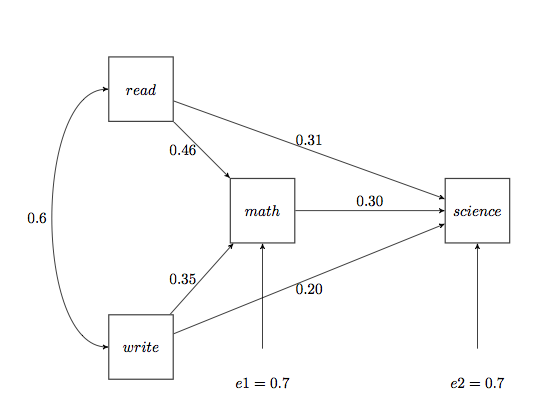
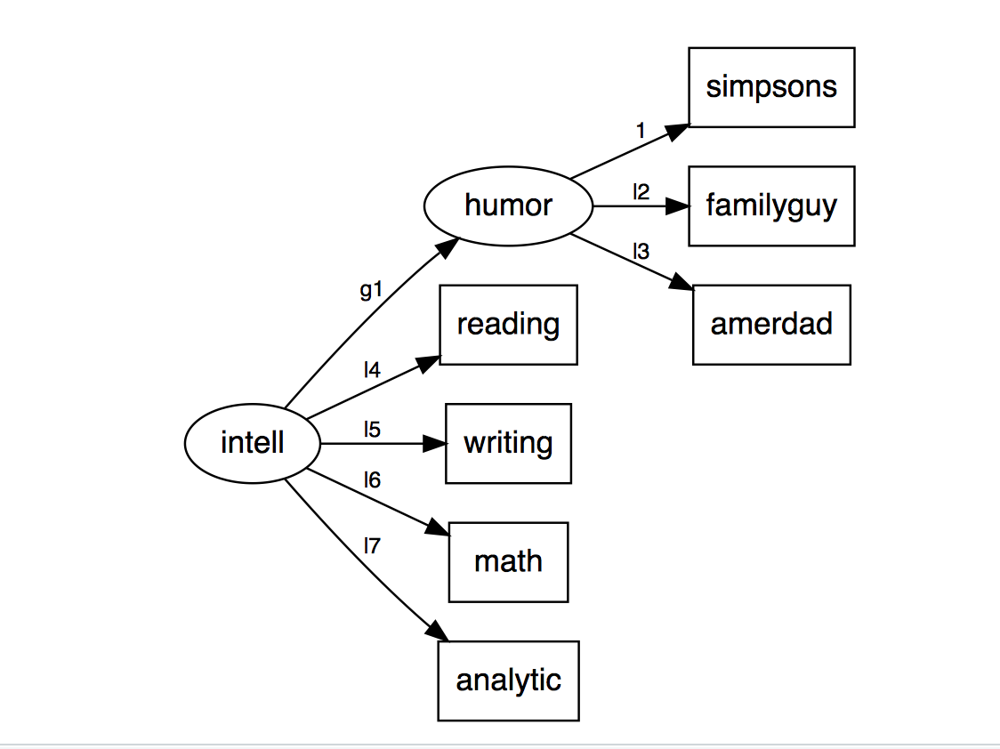

```{r setup, include=FALSE}
knitr::opts_chunk$set(echo = TRUE, fig.align = "center", 
                      message=FALSE, warning=FALSE)
```

## Ecuaciones Estructurales


### Introducción 

Los orígenes de los modelos de ecuaciones estructurales (SEM) se encuentran en las
técnicas desarrollado hace 90 años por Stewal Wright (Wright 1921), que lo desarrollo
en el campo de la genética, cuyo propósito fue el de permitir "el examen de un conjunto
de relaciones entre una o más variables independientes, sean estas continuas o discretas" desarrollando una forma de romper las correlaciones observadas en un sistema de ecuaciones matemáticas que describían sus hipótesis respecto a unas relaciones
causales. Estas relaciones entre las variables fueron representadas en un “path
diagram”, conociéndose este método como “path analysis”.

<br>



<br>

Los modelos de análisis factorial de confirmación son ejemplos relativamente simples de un marco más general para modelar variables latentes y se conocen como modelos de ecuación estructural o modelos de estructura de covarianza. En estos modelos, se asume nuevamente que las variables observadas son indicadores de las variables latentes subyacentes, pero ahora se incorporan las ecuaciones de regresión que enlazan las variables latentes.

El objetivo de las ecuaciones estructurales es explicar las correlaciones o covarianzas de las variables observadas en términos de las relaciones de estas variables con las variables latentes subyacentes asumidas y las relaciones postuladas entre las mismas variables latentes. 


---

### Modelo

Este ejemplo muestra cómo estimas un modelo de ecuaciones estructurales (SEM), usando el paquete `sem` y el paquete `lavaan` de R. 

Este modelo de ecuaciones estructurales consiste en dos modelos de medición, uno de inteligencia y otro del sentido del humor. Se supone que la inteligencia es una variable latente que pude medirse con los resultados de las pruebas en cuatro áreas:
lectura, escritura, matemáticas y análisis. Se supone que el humor es una variable latente que se puede medir por lo mucho que uno disfruta ver los programas: <i>“The Simpsons,” “American Dad,” and “Family Guy.”</i> El modelo también consiste en un consiste en conectar la inteligencia con el humor.


---

### Ejemplo


```{r, message=FALSE, warning=FALSE}
# 0. Librerías
library(tidyverse)
library(forcats)
library(foreign)
library(qgraph)
library(sem)
library(lavaan)
library(semPlot)
theme_set(theme_bw())
```

Los datos se leen de un servidor de [methods consultants](https://www.methodsconsultants.com) los datos están en formato PASW (SPSS).

```{r}
# 1. Datos
data <- read.spss("http://www.methodsconsultants.com/data/intelligence.sav", 
                  to.data.frame=TRUE)
head(data)
```

Las ecuaciones estructurales se estiman usalmente usando la matriz de covarianza de las observaciones. 

Realizamos un analisis exploratorio de la covarianza entre las variables del modelo y se observa que se forman dos grupos uno de los programas “The Simpsons,” “American Dad,” and “Family Guy.”</i> y otro de inteligencia lectura, escritura, matemáticas y análisis. Las variables con mayor coarianza entre ellas son mateáticas con lectura. 

```{r, fig.width=5, fig.height=4}
data.cov <- cov(data)
data.cov %>% 
  as_tibble() %>% 
  mutate(nom = rownames(data.cov)) %>% 
  gather(var.lab, var.val, -nom) %>% 
  mutate(var.val2 = ifelse(var.lab == nom, NA, var.val), 
         nom = factor(nom, levels = c('reading', 'writing', 'math', 
                                      'analytic', 'simpsons', 
                                      'familyguy',  'amerdad')),
         var.lab = factor(var.lab, levels = c('reading', 'writing', 'math', 
                                      'analytic', 'simpsons', 
                                      'familyguy',  'amerdad'))) %>% 
  ggplot(aes(x = nom, y = var.lab, fill = var.val2)) + 
  geom_tile() + 
  ylab(NULL) + xlab(NULL) +  
  theme(axis.text.x = element_text(angle = 90)) + 
  guides(fill = guide_legend("covarianza"))
```

```{r, fig.width=5, fig.height=4}
qgraph(cov(data), borders = FALSE, layout = "spring")
```


#### Librería SEM

##### Especificación del modelo 

El usario especifica el modelo, ya sea directo en R o desde un `.txt`. La sintaxis para `sem::specifyModel()` es la siguiente:

- La primera entrada es la relación entre variables. Cuando se usa `->` se indica que es un coeficiente de regresión y cuando se usa `<->` representa la varianza o covarianza. 

- La segunda entrada es un nombre aleatorio que se la da al parámetro que se va a estatimar. Al introducir `NA` se indica que al parámetro se le da un valor en específico. 

- La tercera entrada es el valor incial o el valor especifico de los parámetros.

Un vez que se tiene el modelo y la matriz de covarianza se usa la función `sem::sem(modelo, matriz, número de observaciones)`.

```{r}
# 3. librería SEM
cat(file = "sem_intellect.txt",
"humor -> simpsons, NA, 1
humor -> familyguy, l2, NA
humor -> amerdad, l3, NA
intell -> reading, l4, NA
intell -> writing, l5, NA
intell -> math, l6, NA
intell -> analytic, l7, NA
intell -> humor, g1, NA
simpsons <-> simpsons, e1, NA
familyguy <-> familyguy, e2, NA
amerdad <-> amerdad, e3, NA
reading <-> reading, d1, NA
writing <-> writing, d2, NA
math <-> math, d3, NA
analytic <-> analytic, d4, NA
intell <-> intell, NA, 1
humor <-> humor, z1, NA")

specify.sem <- sem::specifyModel(file = "sem_intellect.txt")
fit.sem <- sem::sem(specify.sem, data.cov, N = 100)
summary(fit.sem)
```

```{r, fig.keep='first'}
pathDiagram(fit.sem)
```

<br>



<br>


#### Librería Lavaan

En `lavaan` no se necesita la función que especifica al modelo aunque si se debe especificar un modelo y la forma de hacerlo es la siguiente:

- El operador `=~` define las variables latentes

- El operador `~` define una regresión

- El operador `~~` indica correlación 

Un vez que se tiene el modelo y la matriz de covarianza se usa la función `lavaan::sem(modelo, matriz)`.

```{r}
model <- "
# latent variable definitions
humor =~ simpsons + familyguy + amerdad
intell =~ reading + writing + math + analytic
# regressions
intell ~ humor
"

fit.lav <- lavaan::sem(model, data = data)
lavaan::summary(fit.lav, standardized=TRUE)
```

```{r}
lavaan::coef(fit.lav) %>% sort()
```


```{r, fig.width=11, fig.height=6}
semPaths(fit.lav, "std", curvePivot = T, layout = "circle2")
```


```{r}
lavaan::modindices(fit.lav)
```

En `levaan` no es necesario dar nombre a los parámetros ni especificar la varianza. 4


---

### Referencias
- http://www-personal.umich.edu/~gonzo/papers/sem.pdf

- http://masteres.ugr.es/moea/pages/curso201314/tfm1314/tfm-septiembre1314/memoriamasterantonio_lara_hormigo/!

- https://www.methodsconsultants.com/tutorial/structural-equation-models-using-the-sem-package-in-r/